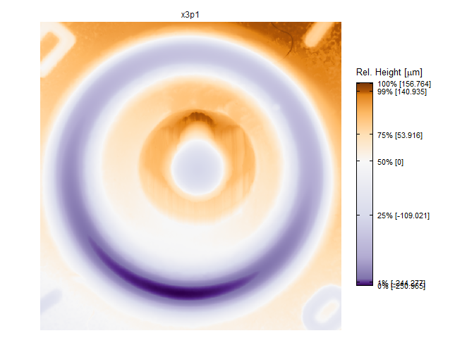
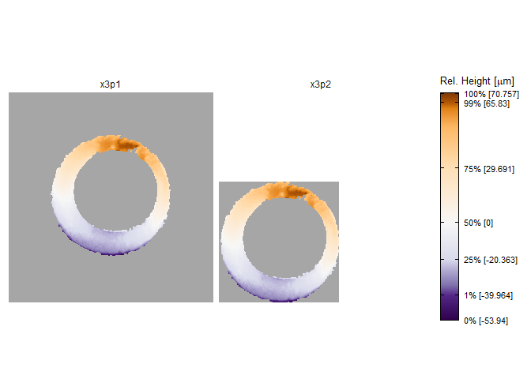

<!-- README.md is generated from README.Rmd. Please edit that file -->

# expppel

<!-- badges: start -->
<!-- badges: end -->

Prepare cartridge case x3p scans for comparison.

## Installation

You can install the development version of expppel like so:

``` r
# install.packages("remotes")
remotes::install_github("jzemmels/expppel")
```

## Example

This is a basic example which shows you how to solve a common problem:

``` r
library(expppel)
data("K013sA1_raw")

attributes(K013sA1_raw)
#> $names
#> [1] "header.info"    "surface.matrix" "feature.info"   "general.info"  
#> [5] "matrix.info"    "mask"          
#> 
#> $class
#> [1] "x3p"

# install.packages("impressions")
impressions::x3pPlot(K013sA1_raw)
```



``` r

# 3D rendering of scan surface + mask:
# install.packages("x3ptools")
# x3ptools::x3p_image(K013sA1_raw)
```

``` r
# remove values based on mask
table(K013sA1_raw$mask) # mask contains mostly black and fewer white pixels
#> 
#> #000000FF #FFFFFFFF 
#>    499462     76519

K013sA1_unmasked <- x3p_extract(K013sA1_raw,"#FFFFFFFF") # keep values associated with white mask elements
impressions::x3pPlot(K013sA1_unmasked,
                     x3p_trim_na(K013sA1_unmasked))
```


